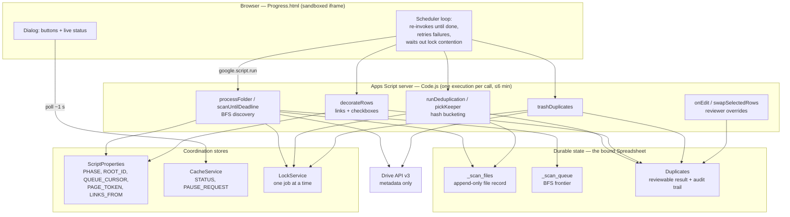
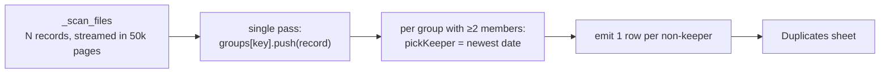
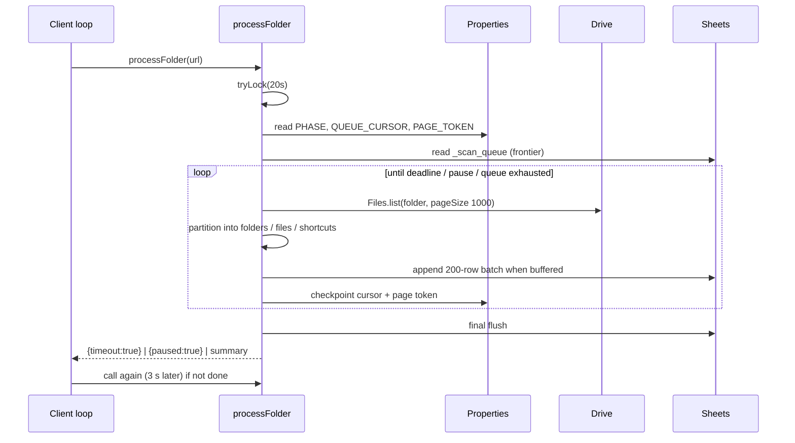

# Deduplicator — Architecture

**Scope.** A container-bound Google Apps Script that walks a Google Drive folder tree,
identifies byte-identical files, presents them for human review in the bound spreadsheet,
and moves the redundant copies to Trash. Target workload at time of writing: ~10⁵ files /
~10⁴ folders / 800 GB in a single tree.

**Design constraint that shapes everything.** Apps Script kills any execution at **6
minutes**. There is no long-running process, no background worker, and no durable
in-process memory. Every unit of work must therefore be (a) decomposable into sub-6-minute
slices, (b) checkpointed to durable storage between slices, and (c) resumable in O(1) — not
by replaying from the beginning. The architecture is essentially a *hand-rolled resumable
job runner* built out of a spreadsheet, three key–value stores, and a browser tab that acts
as the scheduler.

---

## 1. Component model



### Responsibilities

| Component | Owns | Deliberately does *not* own |
|---|---|---|
| `Progress.html` | Scheduling (when to call again), retry policy, contention back-off, user intent | Any state worth keeping — it is disposable; closing the tab loses nothing |
| `processFolder` | One slice of work; phase transitions; converting every failure into a resumable reply | Deciding *how many* slices are needed |
| `scanUntilDeadline` | BFS frontier advance, batched appends, checkpoint on exit | Duplicate detection, de-duplication of records |
| `runDeduplication` | Grouping, keeper selection, result materialisation, status/override carry-over | Trashing, and anything irreversible |
| `decorateRows` | Cosmetics (clickable links, swap checkboxes), resumably | Anything trashing depends on |
| `trashDuplicates` | Irreversible Drive mutation, one row at a time, with a per-row audit mark | Deciding *which* copy survives |
| `onEdit` / `swapSelectedRows` | Reviewer overrides, recorded in the sheet where they survive rebuilds | Drive mutation of any kind |

### Why a spreadsheet is the database

`ScriptProperties` caps a single value at **9 KB** — roughly 40 file records. v4 checkpointed
the whole file list into one property and consequently died at ~40 files with `Argument too
large`. Sheets give three properties that matter here: *incremental append* (checkpoint cost
stays flat instead of rewriting the whole list), *10 million cells* of capacity, and — not to
be underrated — the result is **directly reviewable and editable by a human**, which is the
actual product requirement. The reviewer's edits (deleted rows, swaps) are input to the next
compare, so the database and the UI being the same artefact is a feature, not a shortcut.

---

## 2. The search algorithm

This is the part most often assumed to be quadratic, so it is worth being precise.

### 2.1 What we are *not* doing

The naive formulation — "compare each new file with all files read so far" — is
Θ(N²/2) pairwise comparisons:

| Files (N) | Naive pairwise comparisons |
|---|---|
| 1 000 | 500 000 |
| 37 000 | ~6.8 × 10⁸ |
| 100 000 | ~5.0 × 10⁹ |
| 200 000 | ~2.0 × 10¹⁰ |

At 100k files that is ~5 billion comparisons — hopeless inside 6-minute slices, and it is
also the reason the naive design cannot be checkpointed usefully (each new file depends on
every earlier one). Note the growth is *quadratic*, not exponential (2^N); but quadratic is
already fatal at this N, so the distinction is academic here.

### 2.2 What we actually do — hash bucketing

**Zero pairwise comparisons are performed.** Equality is decided by a key, and identical
keys collide into the same bucket of a hash map:

```
key(file) = md5Checksum + "_" + size
```



Cost per file: one hash-map insert, expected O(1). Total: **Θ(N) expected time**, one pass,
no comparison matrix. Concretely at N = 100 000: 100 000 map operations — microseconds of
CPU, entirely dominated by the cost of *reading* the rows out of Sheets.

Three properties make the key trustworthy:

1. **The hash is free.** `md5Checksum` comes from Drive's own metadata via the Advanced Drive
   Service. **No file content is ever downloaded**, which is why 800 GB costs exactly the
   same as 800 MB. Only *counts* scale.
2. **Size is a co-discriminator.** MD5 alone is collision-prone under adversarial input;
   pairing it with the exact byte size makes an accidental false match effectively
   impossible for non-adversarial data. (Adversarial MD5 collisions *with equal size* are
   constructible — see §6 Risks.)
3. **Absence is handled explicitly.** Google-native files (Docs/Sheets/Slides) have no
   `md5Checksum`, and zero-byte files match each other trivially. Both are recorded and
   **excluded from detection** rather than guessed at.

### 2.3 Keeper selection

Within a group, the surviving copy is the one with the most recent date (`modifiedTime`,
falling back to `createdTime`). `pickKeeper` is a single `reduce` — Θ(group size), so Θ(N)
in total across all groups.

Dates are stored as Drive's **RFC 3339 strings** and compared as *text*. This is deliberate:
the format is fixed-width, UTC-normalised and most-significant-first, so lexicographic order
equals chronological order. No parsing, no `Date` objects, no timezone arithmetic in the hot
path — 10⁵ `new Date()` allocations avoided.

Two tie-breaks keep the output **deterministic**, which matters because the list is rebuilt
repeatedly: an undated file never beats a dated one, and an exact date tie falls back to scan
order (`seq`).

### 2.4 Discovery is breadth-first over a sheet, not recursion

```
queue      = _scan_queue rows      (append-only; grows as folders are found)
cursor     = QUEUE_CURSOR property (integer index into that sheet)
pageToken  = PAGE_TOKEN property   (position inside the current folder's listing)
```

The frontier lives in a sheet and the read head is an integer. Consequences:

- **No recursion**, so no stack depth limit and no re-descent from the root on resume.
- **Resume is O(1)**: read the cursor, continue. v4 re-walked from the root on every resume,
  making a long scan quadratic in the *number of resumes*.
- **Sub-folder granularity**: `PAGE_TOKEN` means a folder with 50 000 children can itself be
  spread across executions.
- **Cycle-safe**: Drive is a DAG (multi-parent files, shortcuts). Folder IDs already queued
  are tracked in a set; shortcuts are skipped outright, since they point elsewhere.

API cost is **Θ(F + N/1000)** Drive calls — one `Files.list` per folder plus one per extra
page of 1000 children. This, not CPU, is the wall-clock cost of the scan.

---

## 3. Time budget and how work is sliced

| Constant | Value | Rationale |
|---|---|---|
| Hard kill | 6 min | Platform limit, not ours |
| `MAX_RUNTIME` | 4.5 min | Soft deadline; the 1.5-min margin absorbs a flush, a retry with backoff, and the final checkpoint write |
| `FLUSH_EVERY` | 200 rows | Bounds work lost to an unclean kill; one `setValues` per 200 files instead of per file |
| `PAGE_SIZE` | 1000 | Drive's max page — fewest round trips per folder |
| `STATUS_EVERY` | 2000 ms | Live status is *sampled*, not streamed: one cache write per 2 s regardless of file rate |
| `TRASH_FLUSH` | 50 rows | Status was one `setValue` per row; that single-cell write was the bottleneck that made 1 600 rows take several executions |
| `LINK_CHUNK` | 500 rows | Rich-text payload per write |
| `READ_PAGE_ROWS` | 50 000 | Caps peak memory when streaming a large sheet |
| `LOCK_WAIT` | 20 s | Absorbs contention between consecutive slices of the same job without a client round trip |

### One scan slice



The client is the scheduler; the server is stateless between calls. This is why closing the
tab, a dropped connection, a laptop sleeping or a hard 6-minute kill are all the same event:
*the loop stops calling*. The checkpoint is already durable, so recovery is one button.

---

## 4. Complexity and capacity summary

N = files, F = folders, G = distinct content groups, D = duplicate rows (D ≤ N − G).

| Stage | Time | Peak memory | Durable writes | Slice-safe? |
|---|---|---|---|---|
| Discovery | Θ(F + N/1000) API calls, latency-bound | **Θ(F + n_slice)** — frontier, folder-ID set, and the IDs recorded *by this slice only* | N + F rows, appended in 200-row batches | Yes — cursor + page token |
| Compare | Θ(N) expected | **Θ(N)** — see §5.1, the binding constraint | D rows, one `setValues` | Partially — values are atomic per run; decoration resumes |
| Decoration | Θ(D) | Θ(500) per chunk | 2 rich-text writes + 1 checkbox insert per 500 rows | Yes — `LINKS_FROM` |
| Trash | Θ(D) API calls, latency-bound | Θ(D) row snapshot | 1 status write per 50 rows | Yes — per-row `Status` |
| Swap | Θ(rows selected) | Θ(1) | 4 cell writes per row | N/A — interactive |

### Observed and projected wall clock

| Workload | Scan | Compare | Trash |
|---|---|---|---|
| 37 000 files (measured) | ~1 h across auto-resumed slices | seconds → 3 700 rows | ~15–30 min for 2 500 files |
| ~100 000 files (projected) | 2–4 h unattended | tens of seconds → ~10 000 rows | ~1 h for 10 000 files |

Trashing is one Drive mutation per file (~200–500 ms) and cannot be batched through
`DriveApp`; it is inherently latency-bound.

---

## 5. Scalability constraints — ranked by how soon they bite

### 5.1 Compare-stage memory — **the binding constraint**

`runDeduplication` holds one JS object per hashed file record in `groups`. That is **Θ(N)
resident memory** inside a single execution:

| N | Approx. resident objects | Assessment |
|---|---|---|
| 100 000 | 100 000 × ~6 fields | Comfortable |
| 200 000 | ~200 000 | Expected to hold; untested |
| 500 000 | ~500 000 | **Likely to fail** — Apps Script's memory ceiling is undocumented, and large-array failures manifest as an opaque kill |

Already mitigated: `forEachDataRow` streams the sheet in 50 000-row pages, so the raw 2-D
array is never resident *in addition* to the map (a 1.2M-cell read was the earlier risk).

Two escape hatches if N approaches 5 × 10⁵, in increasing order of effort:

1. **Aggregate-only first pass.** Keep `Map<key, {count, keeper}>` instead of full member
   lists; a second streaming pass emits rows for non-keepers. Same asymptotics, materially
   smaller constants — no per-group arrays.
2. **Sheet-side sort, then stream.** Sort `_scan_files` by `Hash`+`Size` (Sheets does this
   server-side, outside our 6-minute budget), then walk it once: identical keys are adjacent,
   so only the *current* group is ever resident. Peak memory becomes **Θ(largest group)** —
   effectively O(1). This is the design to adopt if this tool is ever pointed at a
   million-file corpus.

### 5.2 Per-slice startup cost that scales with the job

Each scan slice re-reads `_scan_queue` to rebuild the frontier and its folder-ID set: **Θ(F)
per slice**. At F = 20 000 that is ~40 000 cells, one to three seconds — acceptable against a
270-second budget. At F = 200 000 it would consume a visible fraction of every slice.

*This class of bug already bit once and was fixed:* the scan used to re-read **every recorded
file ID** each slice (Θ(N) per slice, N growing monotonically) to keep `_scan_files` free of
repeats. That cost compounds — the further you get, the slower you go — and it is precisely
what prevents a large tree from ever finishing. Repeats are now collapsed by ID at compare
time, which already reads the list exactly once, with a per-execution set covering the common
case (a folder re-listed after a stale page token).

That trade-off carries a **load-bearing invariant**: a file recorded twice must never be
reported as a duplicate *of itself*. `runDeduplication` de-duplicates by file ID on the way
in; the test suite asserts this for both mechanisms that produce repeats (stale-page-token
re-listing, and a file reachable through two parents).

### 5.3 Spreadsheet capacity — 10 million cells, shared

| Sheet | Cells | At N = 100k / F = 20k / D = 10k |
|---|---|---|
| `_scan_files` | 6 × N | 600 000 |
| `_scan_queue` | 2 × F | 40 000 |
| `Duplicates` | 13 × D | 130 000 |
| **Total** | | **~0.8 M of 10 M (8 %)** |

Headroom is large: the hard wall is around **N ≈ 1.5 M files**. Note the quota is
per-*spreadsheet*, so the checkpoint sheets and the human-facing result compete for the same
budget — reviewer-added helper columns count too.

### 5.4 Platform quotas — the constraint people forget

Verify against current Google documentation for the account tier in use; these change.

| Quota | Consumer Gmail | Workspace | Relevance |
|---|---|---|---|
| Runtime per execution | 6 min | 6 min | Architected around |
| **Total script runtime / day** | **~90 min** | **~6 h** | **A 3-hour scan is impossible on a consumer account in one day** — it will simply stop and resume tomorrow |
| Simultaneous executions | 30 | 30 | We hold one, plus the client's next call |
| Drive API requests | ~1 000 / 100 s / user | same | Θ(F + N/1000) calls spread over hours is far below this |
| Properties value / total | 9 KB / 500 KB | same | Why bulk state is in sheets |
| Cache value / TTL | 100 KB / 6 h | same | Status and pause flag only |

The daily-runtime ceiling is the one that can turn "unattended overnight" into "several
days". It is not a failure mode — the checkpoint simply waits — but it is a planning input.

### 5.5 Latency floors that no amount of code removes

Discovery is ~1 API round trip per folder; trashing is exactly 1 per file. Both are bound by
Drive's response time, not by our CPU. The only lever is fewer round trips (already at
`PAGE_SIZE` = 1000), so **the scan cannot be made materially faster** within this platform.
Parallelism is not available: Apps Script has no threads, and concurrent executions would
contend for the same lock and checkpoint.

---

## 6. Correctness invariants and risk register

### Invariants the implementation guarantees

| Invariant | Mechanism |
|---|---|
| **Every content group keeps at least one copy** | n copies produce n−1 rows, so at most n−1 distinct files can ever be trashed — *regardless* of how the reviewer swaps rows |
| Compare is idempotent | Rebuilding the list yields the same rows; `Status` carries over by file ID, reviewer swaps carry over by unordered pair key |
| No work is lost to a failure | Every slice checkpoints before exiting; every failure is returned as `{error, resumable}` rather than thrown at the client |
| Trashing never repeats | Per-row `Status` gates re-attempts; re-trashing an already-trashed file is a no-op anyway |
| A filename cannot become a formula | Appended ranges are forced to plain-text number format first — a file named `=total.xlsx` is stored as text |
| A filter cannot cause invisible edits | Row-hidden checks in `selectedDataRows`; the checkbox path only ever acts on ticked rows |
| Reviewer overrides survive rebuilds | `readPairChoices` compares the sheet's stated duplicate against the date rule's default and preserves the difference |

### Risks

| Risk | Severity | Status |
|---|---|---|
| **MD5 + size collision on adversarial input** | Data loss | Accepted. Chosen-prefix MD5 collisions with equal length are constructible; two *deliberately crafted* files would be judged identical. Irrelevant for organic document corpora; unacceptable if this were ever pointed at untrusted uploads, where SHA-256 (requiring content download) would be needed |
| Compare-stage memory at N ≫ 2 × 10⁵ | Job cannot complete | Mitigations designed, not implemented (§5.1) |
| Clearing the `Duplicates` sheet erases reviewer overrides | Data loss on a *subsequent* compare+trash | Documented in README; overrides live only in that sheet |
| Hand-editing `_scan_queue` | Silent under-reporting | `QUEUE_CURSOR` is positional; deleting rows above it shifts the walk. Documented; `Reset Scan Progress` is the supported path |
| Daily runtime quota exhaustion | Schedule slip only | Inherent; checkpoint waits |
| Drive rate limits / 5xx | Slice failure | `withRetry` with exponential backoff on transient errors; unreadable folders are skipped rather than fatal |

---

## 7. Coordination: why three different stores

| Store | Holds | Why not one of the others |
|---|---|---|
| Sheets | Bulk records (N + F + D rows) | Only store with the capacity, append semantics, *and* human reviewability |
| `ScriptProperties` | 5 small cursors | Durable across executions; 9 KB/value makes it useless for bulk |
| `CacheService` | Live status, pause request | **The property store is read into an execution once**, so a running scan cannot reliably observe a flag another execution just set. Cache reads cross that boundary — which is exactly what "pause the scan from a button click" requires |
| `LockService` | Mutual exclusion | Scan, compare and trash all rewrite the same sheets; the lock serialises them, and contention is reported as `busy` (retryable) rather than as failure |

**Failure semantics by design:** the client treats three replies differently — `busy`
(wait 20 s, retry, separate budget from failures, because waiting is not failing),
`resumable` error (retry up to 6 times, 6 s apart), and terminal error (stop and explain).
This is why a 3 700-row trash run survives lock contention, a killed execution and a network
blip without a human deciding anything.

---

## 8. Where to look in the code

| Concern | Symbol |
|---|---|
| Slice orchestration, phase machine | `processFolder` |
| BFS advance, checkpointing | `scanUntilDeadline`, `seedQueue`, `restartWalkIfRecordsLost` |
| Hash bucketing, keeper choice | `runDeduplication`, `pickKeeper` |
| Streaming a large sheet | `forEachDataRow` |
| Resumable cosmetics | `decorateRows`, `finishPendingLinks`, `lastDuplicateRow`, `linkRuns` |
| Irreversible stage | `trashDuplicates` |
| Reviewer overrides | `onEdit`, `swapSelectedRows`, `selectedDataRows`, `swapKeeper`, `readPairChoices` |
| Resilience primitives | `withRetry`, `isTransient`, `describeError`, `busyReply` |
| Layout migration | `getSheet`, `writeHeaders`, `headersMatch`, `readByHeaders` |
| Observability | `logIt`, `setStatus`, `getLiveStatus`, `getState` |
| Client scheduler | `Progress.html` — `callScan`, `handleFinish`, `runTrash`, `waitForLock`, `finishLinks` |

---

## 9. Verification approach

The logic is exercised against a **fake Sheets/Drive API** (an in-memory sheet model with
ranges, rich text, checkboxes, filters and selections) so that column layouts, the keeper
rule, swap semantics, repeat collapsing, status carry-over, layout migration and deferred
decoration are all asserted without touching a real spreadsheet — currently 61 assertions.

Two limits worth stating plainly: the harness models the API's *contract*, not Google's
performance, so **no memory or timing claim in §5 is measured** — those are reasoned
estimates, and the 2 × 10⁵ threshold in §5.1 in particular is an untested projection. And
the harness is a development artefact, not part of the deployed script.

---

## 10. If this were rebuilt at 10× scale

The current design is the right shape for 10⁵ files inside Apps Script. Beyond ~10⁶, the
platform — not the algorithm — is the wrong host:

1. **Sort-then-stream the compare** (§5.1) — the single highest-value change, and it fits
   the current architecture.
2. **Move discovery to Drive's `changes`/incremental listing** so re-scans are deltas rather
   than full walks. Today a second run over the same tree costs the same as the first.
3. **Leave Apps Script.** A service account plus a real datastore removes the 6-minute
   slicing, the daily runtime ceiling, and the single-threaded latency floor at once — at the
   cost of the property that makes this tool usable today: the result is a spreadsheet the
   owner already knows how to review.
